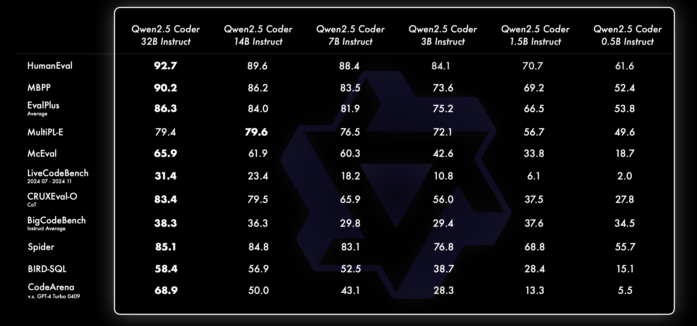
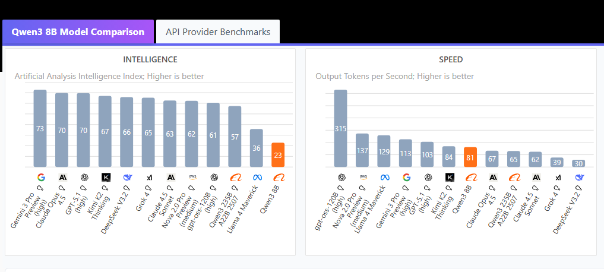

# FraudeCode

| NAME             | ID           | SIZE   |
| :--------------- | :----------- | :----- |
| tinyllama:latest | 2644915ede35 | 637 MB |
| mistral:latest   | 6577803aa9a0 | 4.4 GB |
| phi4:latest      | ac896e5b8b34 | 9.1 GB |
| qwen2.5-coder:7b | dae161e27b0e | 4.7 GB |
| qwen3:8b         | 500a1f067a9f | 5.2 GB |

Using qwen2.5-coder:7b and qwen3:8b

Model: phi4:latest
architecture phi3  
parameters 14.7B  
context length 16384  
embedding length 5120  
quantization Q4_K_M

Model: mistral:latest
architecture llama  
parameters 7.2B  
context length 32768  
embedding length 4096  
quantization Q4_K_M

Model: tinyllama:latest
architecture llama  
parameters 1B  
context length 2048  
embedding length 2048  
quantization Q4_0

Model: qwen3:8b
architecture qwen3  
parameters 8.2B  
context length 40960  
embedding length 4096  
quantization Q4_K_M
(Completion and Thinking)
